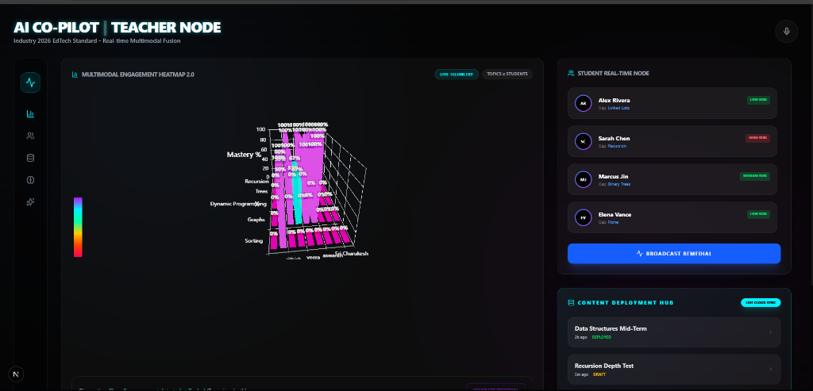
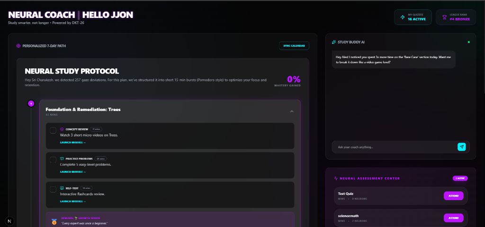

<div align="center">

# 🧠 Neural Learning Gap Detector
### *Industry 2026 Level — AI-Powered Adaptive Education Platform*

[](https://neural-learning-gap-detector-m7il.vercel.app/)
[](https://railway.app)
[](https://nextjs.org/)
[](https://fastapi.tiangolo.com/)
[](https://python.org/)
[](https://react.dev/)
[](LICENSE)

**A next-generation AI-powered educational platform that identifies student learning gaps in real-time, tracks mastery decay using Deep Knowledge Tracing (DKT), and generates hyper-personalized 7-day remedial study plans powered by Groq's Llama 3.1 LLM — with forensic behavioral proctoring via MediaPipe.**

[**🌐 View Live App →**](https://neural-learning-gap-detector-m7il.vercel.app/) &nbsp;|&nbsp; [**📦 GitHub Repo →**](https://github.com/Sricharukesh200508/Neural-Learning-Gap-Detector) &nbsp;|&nbsp; [**⚙️ API Docs →**](https://neural-learning-gap-detector-m7il.vercel.app/api)

</div>

---

## 📸 System Interfaces

### 🎓 AI Co-Pilot Teacher Node

> The Teacher Node features a real-time **Multimodal Engagement Heatmap 2.0** that plots student mastery across concepts (Recursion, Trees, Dynamic Programming). Includes a **Student Real-Time Node** for identifying high-risk students and a **Content Deployment Hub** for immediate quiz assignment.

### 🧑‍💻 Neural Coach & Student Portal

> The Student Portal features the **Neural Coach** AI, which generates a **Personalized 7-Day Study Protocol** based on detected gaze deviations and learning gaps. Integrates a **Study Buddy AI** for instant conceptual help and a **Neural Assessment Center** for active learning.

---

## 🌐 Live Deployment

| Service | Platform | URL |
|---|---|---|
| 🎨 Frontend (Next.js) | Vercel | [neural-learning-gap-detector-m7il.vercel.app](https://neural-learning-gap-detector-m7il.vercel.app/) |
| ⚙️ Backend (FastAPI) | Railway | Configured via `railway.json` |
| 📄 API Root | FastAPI | `GET /` → `{"status": "online"}` |

---

## 🚀 System Architecture

```
┌─────────────────────────────────────────────────────────────────┐
│                     NEURAL LEARNING GAP DETECTOR                │
│                         Architecture v1.0                       │
├──────────────────────┬──────────────────────────────────────────┤
│   FRONTEND (Vercel)  │          BACKEND (Railway)               │
│   Next.js 16.2       │          FastAPI + Uvicorn               │
│   React 19           │          Python 3.10+                    │
│   TypeScript         │                                          │
│   TailwindCSS 4      │  ┌──────────────────────────────────┐   │
│   Framer Motion      │  │   AI Engine (logic_ai.py)         │   │
│   ECharts / Recharts │  │   - DKT Knowledge Decay Model     │   │
│   MediaPipe (WebGL)  │  │   - Groq Llama 3.1 (LLM)         │   │
│   Monaco Editor      │  │   - Forensic Anomaly Detection   │   │
│                      │  └──────────────────────────────────┘   │
│  ┌───────────────┐   │  ┌──────────────────────────────────┐   │
│  │  Teacher UI   │   │  │   WebSocket Telemetry Server      │   │
│  │  Student UI   │◄──►  │   /ws/telemetry/{client_id}       │   │
│  │  CMS Module   │   │  │   Real-time forensic streaming    │   │
│  └───────────────┘   │  └──────────────────────────────────┘   │
│                      │  ┌──────────────────────────────────┐   │
│  ENV: NEXT_PUBLIC_   │  │   JSON CMS Store (storage/)      │   │
│       API_URL        │  │   Zero-setup persistence layer    │   │
└──────────────────────┴──┴──────────────────────────────────────┘
```

---

## ✨ Feature Breakdown

### 🧠 AI Intelligence Layer (`backend/logic_ai.py`)

| Feature | Description |
|---|---|
| **DKT Decay Prediction** | Simulates Deep Knowledge Tracing to forecast mastery decay over 48–72 hours. Complex topics (Recursion, DP) decay at 15% vs 5% for simpler topics. |
| **Groq LLM Integration** | Calls `llama-3.1-8b-instant` via Groq API to generate full 7-day study plans with spaced repetition, interleaving, and gamification. |
| **Fallback Mock Engine** | If no Groq API key is set, a production-quality mock plan is returned instantly, ensuring seamless demos. |
| **Anomaly Clustering** | Groups students using simulated embedding clustering into behavioral cohorts (high accuracy/low engagement, etc.). |
| **Forensic Integrity Scoring** | AI penalizes `look_away_count` events from MediaPipe to calculate an `ai_integrity_score` per submission. |
| **PDF Report Export** | Auto-generates downloadable PDF learning gap reports per student via ReportLab. |

### 🎨 Frontend Capabilities (`frontend/src/`)

| Module | Route | Description |
|---|---|---|
| **Landing Page** | `/` | Animated hero with role selection (Teacher / Student) |
| **Teacher Dashboard** | `/teacher` | Real-time class heatmap, student risk monitor, quiz deployer |
| **Student Portal** | `/student` | Neural quiz engine, 7-day study plan, progress tracker |
| **CMS Engine** | Internal | Subject management, question bank, quiz builder |
| **Telemetry Client** | WebSocket | Streams MediaPipe facial vectors to backend in real-time |

### 🔬 MediaPipe Deep Proctoring (`frontend/src/components/telemetry/`)

- **3D Facial Landmark Tracking**: WebGL-powered 468-point face mesh via `@mediapipe/face_mesh`
- **Gaze Deviation Analysis**: Absolute pupil deviation measured over time, flags `look_away_count`
- **Lip Synchrony Mapping**: Detects whispering via lip distance vector analysis
- **Real-time WebSocket Streaming**: Forensic telemetry pushed to `/ws/telemetry/{client_id}` at 30fps
- **AI Integrity Scoring**: Backend scores each submission with `ai_integrity_score = score - (look_away × 2)`

---

## 🛠️ Backend API Reference

**Base URL (local):** `http://localhost:8000`  
**Base URL (production):** Set via `NEXT_PUBLIC_API_URL` env variable

### Core Endpoints

```http
GET  /                                         → API health check
GET  /api/cms/data                             → Full CMS database dump
POST /api/cms/subjects                         → Create a new subject
POST /api/cms/quizzes                          → Deploy a quiz
POST /api/cms/questions                        → Add question to bank
POST /api/cms/results                          → Submit & AI-score quiz result
GET  /api/teacher/results                      → All results + AI analytics
POST /api/teacher/assignments                  → Assign quiz to students
GET  /api/teacher/assignments/{quiz_id}/status → Real-time completion counters
POST /api/student/generate-plan               → Trigger 7-day LLM study plan
POST /api/generate-study-plan                 → Direct plan generation
GET  /api/student/assigned-quizzes            → Student's quiz queue
POST /api/student/start-quiz/{assignment_id}  → Create attempt record
POST /api/student/submit-quiz/{attempt_id}    → Submit answers + telemetry
GET  /api/student/mastery/{student_id}        → Per-topic mastery analytics
POST /api/student/study-plan-progress         → Sync progress to backend
GET  /export/report/{student_id}              → Download PDF gap report
WS   /ws/telemetry/{client_id}               → Real-time MediaPipe stream
```

### POST `/api/analyze/gap_detection` — DKT Gap Detection
```json
{
  "student_id": "ST_001",
  "topic": "Recursion",
  "mastery": 0.65
}
```
**Response:**
```json
{
  "decay_prediction": {
    "student_id": "ST_001",
    "topic": "Recursion",
    "current_mastery": 0.65,
    "predicted_mastery_48h": 0.5525,
    "risk_level": "High"
  },
  "recommended_action": {
    "action": "Send micro-remedial",
    "reason": "Predicted decay below 50% for Recursion",
    "template_id": "ST-001-RECURSION"
  }
}
```

### POST `/api/cms/results` — AI-Scored Submission
```json
{
  "student_id": "ST_001",
  "student_name": "Alex",
  "score": 72,
  "look_away_count": 8,
  "weak_topics": ["Recursion", "Dynamic Programming"],
  "topic_performance": [
    { "topic": "Trees", "is_correct": true },
    { "topic": "Recursion", "is_correct": false }
  ]
}
```
**Response:**
```json
{
  "status": "success",
  "ai_integrity_score": 56.0,
  "ai_flag": true,
  "ai_comment": "⚠ Forensic flag: 8 gaze deviations. Manual review recommended."
}
```

---

## 🏗️ Project Structure

```
Neural-Learning-Gap-Detector/
├── 📁 backend/                    # FastAPI Python backend
│   ├── main.py                    # 500+ line API server (all routes)
│   ├── logic_ai.py                # AI/ML engine (DKT, Groq, forensics)
│   ├── requirements.txt           # Python dependencies
│   ├── 📁 api/                    # Modular API routers
│   ├── 📁 core/                   # Core utilities & config
│   ├── 📁 models/                 # Pydantic data models
│   ├── 📁 logic/                  # Business logic modules
│   └── 📁 storage/
│       └── database.json          # Zero-config JSON persistence layer
│
├── 📁 frontend/                   # Next.js 16.2 / React 19 app
│   ├── vercel.json                # Vercel deployment config
│   ├── next.config.ts             # Turbopack + webpack config
│   ├── package.json               # Node dependencies
│   └── 📁 src/
│       ├── 📁 app/
│       │   ├── layout.tsx         # Root layout with providers
│       │   ├── page.tsx           # Landing / role selector
│       │   ├── 📁 teacher/        # Teacher dashboard routes
│       │   └── 📁 student/        # Student portal routes
│       ├── 📁 components/
│       │   ├── 📁 cms/            # CMS management components
│       │   └── 📁 telemetry/      # MediaPipe proctoring components
│       ├── 📁 lib/
│       │   └── api.ts             # Central API base URL config
│       └── 📁 types/              # TypeScript type definitions
│
├── 📁 docs/                       # GitHub Pages documentation site
├── Dockerfile                     # Docker config for FastAPI backend
├── railway.json                   # Railway deployment manifest
├── render.yaml                    # Render deployment config
└── README.md                      # This file
```

---

## 🛠️ Local Development Setup

### Prerequisites
- **Node.js** 20+
- **Python** 3.10+
- **Git**

### 1. Clone the Repository
```bash
git clone https://github.com/Sricharukesh200508/Neural-Learning-Gap-Detector.git
cd Neural-Learning-Gap-Detector
```

### 2. Backend Setup (FastAPI)
```bash
cd backend

# Create and activate virtual environment
python -m venv myenv

# Windows
.\myenv\Scripts\activate

# macOS / Linux
source myenv/bin/activate

# Install dependencies
pip install -r requirements.txt

# (Optional) Create .env file for API keys
echo GROQ_API_KEY=your_key_here > .env

# Start the server
python main.py
```
> ✅ API available at **`http://localhost:8000`**  
> 📖 Interactive docs at **`http://localhost:8000/docs`**

### 3. Frontend Setup (Next.js)
```bash
cd frontend

# Install dependencies
npm install

# Create environment file
echo NEXT_PUBLIC_API_URL=http://localhost:8000 > .env.local

# Start development server
npm run dev
```
> ✅ Dashboard available at **`http://localhost:3000`**

---

## ☁️ Deployment Guide

### Frontend → Vercel

1. Go to [vercel.com](https://vercel.com) → **New Project** → Import `Neural-Learning-Gap-Detector`
2. In **Configure Project**, set **Root Directory** to `frontend`
3. Add environment variable:
   ```
   NEXT_PUBLIC_API_URL = https://your-railway-backend.up.railway.app
   ```
4. Click **Deploy** ✅

### Backend → Railway

1. Go to [railway.app](https://railway.app) → **New Project** → **Deploy from GitHub**
2. Select `Neural-Learning-Gap-Detector` repository
3. Railway auto-reads `railway.json` and runs:
   ```bash
   cd backend && pip install -r requirements.txt && uvicorn main:app --host 0.0.0.0 --port $PORT
   ```
4. Add environment variable (optional):
   ```
   GROQ_API_KEY = gsk_your_groq_api_key_here
   ```
5. Go to **Settings** → **Networking** → **Generate Domain** → copy the URL
6. Paste the URL as `NEXT_PUBLIC_API_URL` in your Vercel project ✅

### Backend → Docker
```bash
# Build image
docker build -t neural-gap-detector .

# Run container
docker run -p 8000:8000 -e GROQ_API_KEY=your_key neural-gap-detector
```

---

## 🔐 Environment Variables

### Frontend (`frontend/.env.local`)
| Variable | Required | Example | Description |
|---|---|---|---|
| `NEXT_PUBLIC_API_URL` | ✅ Yes (prod) | `https://your-app.up.railway.app` | FastAPI backend base URL |

### Backend (`backend/.env`)
| Variable | Required | Example | Description |
|---|---|---|---|
| `GROQ_API_KEY` | ⚠️ Optional | `gsk_abc123...` | Groq LLM key. Falls back to mock plan if absent. |

---

## 🧰 Tech Stack

### Frontend
| Technology | Version | Role |
|---|---|---|
| Next.js | 16.2.4 | React framework with Turbopack |
| React | 19.2.4 | UI library |
| TypeScript | 5+ | Type safety |
| TailwindCSS | 4 | Utility-first styling |
| Framer Motion | 12.38 | Animations & transitions |
| ECharts + echarts-gl | 5.5 | 3D data visualizations |
| Recharts | 3.8 | Chart components |
| @mediapipe/face_mesh | 0.4 | Real-time 3D facial tracking |
| @monaco-editor/react | 4.7 | In-browser code editor |
| @tanstack/react-query | 5.99 | Async data fetching & caching |
| Axios | 1.15 | HTTP client |
| React Hook Form + Zod | Latest | Form validation |
| KaTeX | 0.16 | Math formula rendering |

### Backend
| Technology | Version | Role |
|---|---|---|
| FastAPI | Latest | High-performance async API framework |
| Uvicorn | Latest | ASGI server |
| Groq SDK | Latest | Llama 3.1 LLM integration |
| ReportLab | Latest | PDF generation |
| Pandas | Latest | Data analysis |
| Python-dotenv | Latest | Environment variable management |
| WebSockets | Latest | Real-time telemetry streaming |

---

## 🌟 Advanced Features Deep Dive

### 🔭 Deep Knowledge Tracing (DKT) Engine
The system simulates DKT — a transformer-based model used in edtech research — to predict how quickly a student's mastery of a topic will decay without intervention.

```python
# From logic_ai.py
decay_rate = 0.15 if topic in ['Recursion', 'Dynamic Programming'] else 0.05
predicted_mastery_48h = current_mastery * (1 - decay_rate)
```

Complex topics decay **3× faster** than foundational ones, triggering automatic remedial interventions.

### 🤖 Groq LLM Study Plan Generation
The system prompts `llama-3.1-8b-instant` with a highly engineered system prompt based on:
- **Spaced Repetition** — reviews weak topics across increasing intervals
- **Interleaving** — mixes topic types to prevent massed practice
- **Progressive Difficulty** — easy → medium → hard across 7 days
- **Retrieval Practice** — forced self-testing every session
- **Behavioral Awareness** — adapts workload based on gaze deviation count

Returns a fully-structured JSON study plan with daily themes, time blocks, resources, and gamification badges.

### 🎯 Forensic Integrity Engine
Every quiz submission is automatically scored by the AI:
```
ai_integrity_score = raw_score - (look_away_count × 2)
ai_flag = True if look_away_count > 5
```
Teachers see a forensic comment per student: `"⚠ Forensic flag: 8 gaze deviations. Manual review recommended."`

### 📊 Zero-Config CMS Store
All data (subjects, quizzes, questions, results, assignments, attempts) is persisted to a single `storage/database.json` with UTF-8 BOM handling and corruption recovery — no database setup required.

---

## 📈 Recent Commits

| Commit | Message | Author |
|---|---|---|
| `55ea280` | Move vercel.json into /frontend for correct monorepo Vercel deployment | Sricharukesh200508 |
| `3f12aa9` | Fix vercel.json and Dockerfile; remove Streamlit requirements | Sricharukesh200508 |
| `79cbca1` | Fix deployment configs for Vercel and Railway | Sricharukesh200508 |
| `6716c68` | Change CTA to Open App | Sricharukesh200508 |
| `cd11a89` | Add .nojekyll to disable Jekyll | Sricharukesh200508 |

---

## ⚠️ System Requirements

| Requirement | Minimum | Recommended |
|---|---|---|
| Node.js | 20+ | 22 LTS |
| Python | 3.10+ | 3.12 |
| RAM | 4GB | 8GB+ |
| Browser | Chrome 90+ | Chrome 120+ (for MediaPipe WebGL) |
| Groq API Key | Optional | Recommended for full LLM plans |

> 💡 **No Groq key?** The system automatically falls back to a production-quality mock study plan with realistic 7-day schedules — perfect for demos.

---

## 🤝 Contributing

1. Fork the repository
2. Create your feature branch: `git checkout -b feature/your-feature`
3. Commit your changes: `git commit -m "Add your feature"`
4. Push to the branch: `git push origin feature/your-feature`
5. Open a Pull Request

---

## 📄 License

This project is licensed under the **MIT License** — see the [LICENSE](LICENSE) file for details.

---

<div align="center">

**Built for the 2026 AI Hackathon** | Powered by Groq × MediaPipe × Next.js × FastAPI

[🚀 Live Demo](https://neural-learning-gap-detector-m7il.vercel.app/) · [📦 Repository](https://github.com/Sricharukesh200508/Neural-Learning-Gap-Detector) · [🐛 Report Bug](https://github.com/Sricharukesh200508/Neural-Learning-Gap-Detector/issues)

</div>
