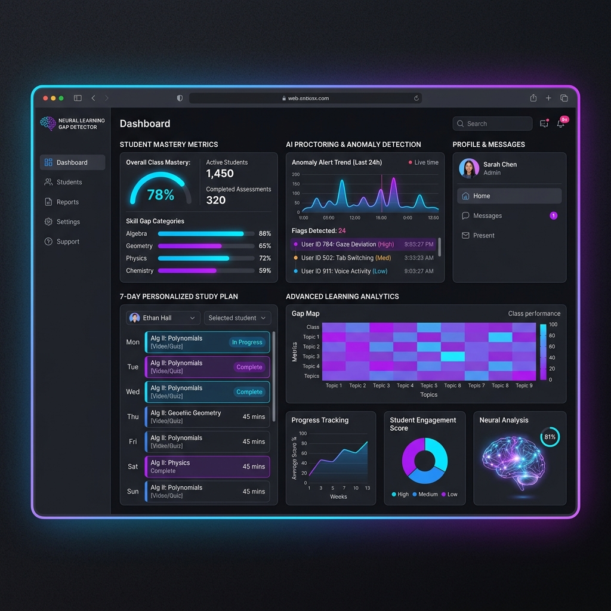

# 🧠 Neural Learning Gap Detector (Industry 2026 Level)



A next-generation, AI-powered educational platform designed to identify learning gaps, track student mastery in real-time, and generate highly personalized remedial action plans using advanced LLM reasoning and forensic behavioral tracking.

## 🚀 System Architecture

This project is built using a modern, scalable, and highly performant architecture:

### ⚡ Backend (FastAPI / Python)
The neural engine is powered by Python and FastAPI, serving as the core intelligence layer.
- **Real-time Analytics**: WebSocket connections stream high-frequency forensic data (gaze tracking, lip-sync deviations).
- **Knowledge Decay Prediction**: Simulates Deep Knowledge Tracing (DKT) to predict mastery decay over a 48-72 hour window.
- **LLM Engine Integration**: Uses Groq (Llama 3.1) to generate hyper-personalized 7-day study plans (Pomodoro intervals, interleaved practice, gamification elements) based on precise performance vectors.

### 🎨 Frontend (Next.js 16.2 / React 19)
The application UI is an immersive, glassmorphism-inspired dashboard that provides teachers and students with deep insights.
- **Teacher Dashboard**: Monitor class anomalies, assign AI-proctored quizzes, and view automatically generated learning interventions.
- **Student Node**: Take neural quizzes, receive instant feedback, and execute auto-generated 7-day remedial study plans.

## 🛠 Setup & Deployment

### 1. Backend API Start Sequence
Ensure you have Python 3.10+ installed.

```bash
cd backend
python -m venv myenv
.\myenv\Scripts\activate   # Windows
pip install -r requirements.txt
python main.py
```
*The API will be available at `http://localhost:8000`.*

### 2. Frontend Launch Sequence
Ensure you have Node.js 20+ installed.

```bash
cd frontend
npm install
npm run dev
```
*The Dashboard will be accessible at `http://localhost:3000`.*

## 🌟 Advanced Features

- **MediaPipe Deep Proctoring**: Utilizes WebGL tracking to capture 3D facial vectors, calculating lip synchrony mapping to detect whispering, and measures absolute pupil deviation over time.
- **Dynamic Quiz Engine**: Deploy assessments directly to student nodes with randomized vectors and multi-tier scheduling.
- **Automated CMS Store**: Zero-setup JSON persistence for quick scaling without complex database dependencies.
- **AI Feedback Loop**: Generates forensic warnings (e.g., "⚠ Forensic flag: 175 gaze deviations") to maintain integrity.

## ⚠️ Requirements
- Node 20+
- Python 3.10+
- Groq API Key (Optional, fallback mock logic is provided for seamless demos)
